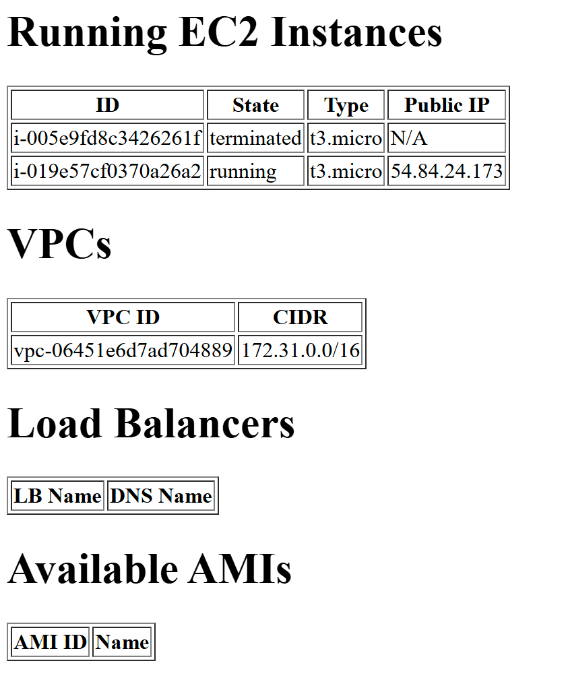

#  Python EC2 Resource Viewer (Dockerized Flask App)

This project provides a simple **Flask + boto3** web application that runs inside Docker on an AWS EC2 instance.  
When deployed, the app can display available resources in your AWS account.  

---

##  Requirements
- **AWS EC2 instance** (tested on `ami-00ca32bbc84273381`)  
- **Security Group inbound rules**:
  - SSH (TCP port **22**) → for connecting to the instance  
  - Custom TCP (port **5001**) → for accessing the app in a browser  
- **Key Pair (`.pem`)** → to SSH into the EC2 instance  
- **Python app dependencies**: `Flask`, `boto3`  
- **Docker** & **Git** installed on the EC2  

---

##  Setup Instructions

### 1. Connect to your EC2
```bash
ssh -i /path/to/key-pair.pem ec2-user@<EC2_PUBLIC_IP>
```

### 2. Install Docker & Git
Update packages, install Docker, and start the service:
```bash
sudo yum update -y
sudo yum install -y docker git
sudo systemctl enable docker
sudo systemctl start docker
```

### 3. Clone the Repository (Docker branch)
```bash
git clone -b Docker https://github.com/TomerBahar22/Project.git
cd Project/
```
### Or docker Hub ([Docker Image](https://hub.docker.com/r/tomerbahar2/python-web))
```bash
docker pull tomerbahar2/python-web

```
### 4. Build the Docker Image
```bash
sudo docker build -t python-web:latest .
```

### 5. Run the Container
Replace values with your AWS credentials:
```bash
sudo docker run -d -p 5001:5001   -e AWS_ACCESS_KEY_ID=<your_access_key>   -e AWS_SECRET_ACCESS_KEY=<your_secret_key>   -e AWS_DEFAULT_REGION=us-east-1   python-web:latest
```

---

## 🌐 Access the App
From your local PC browser:
```
http://<EC2_PUBLIC_IP>:5001/
```

```

---

## 🐛 Troubleshooting

- **Always use `sudo`** before Docker commands.  
- Verify image/container status:
  ```bash
  sudo docker images
  sudo docker ps
  ```
  - `docker ps` output must show:  
    ```
    0.0.0.0:5001->5001/tcp
    ```
- Test from EC2 itself:
  ```bash
  curl http://127.0.0.1:5001/
  ```
- Make sure you cloned the correct branch (`Docker`) and did not change folder or file names.  
- If the app doesn’t start:
  - Check logs → `sudo docker logs <container_id_or_name>`  
  - Confirm you used the correct AWS region (`us-east-1` is required).  

---

✅ With this setup, your Flask app will be up and accessible from your browser at port 5001 on your EC2’s public IP.
